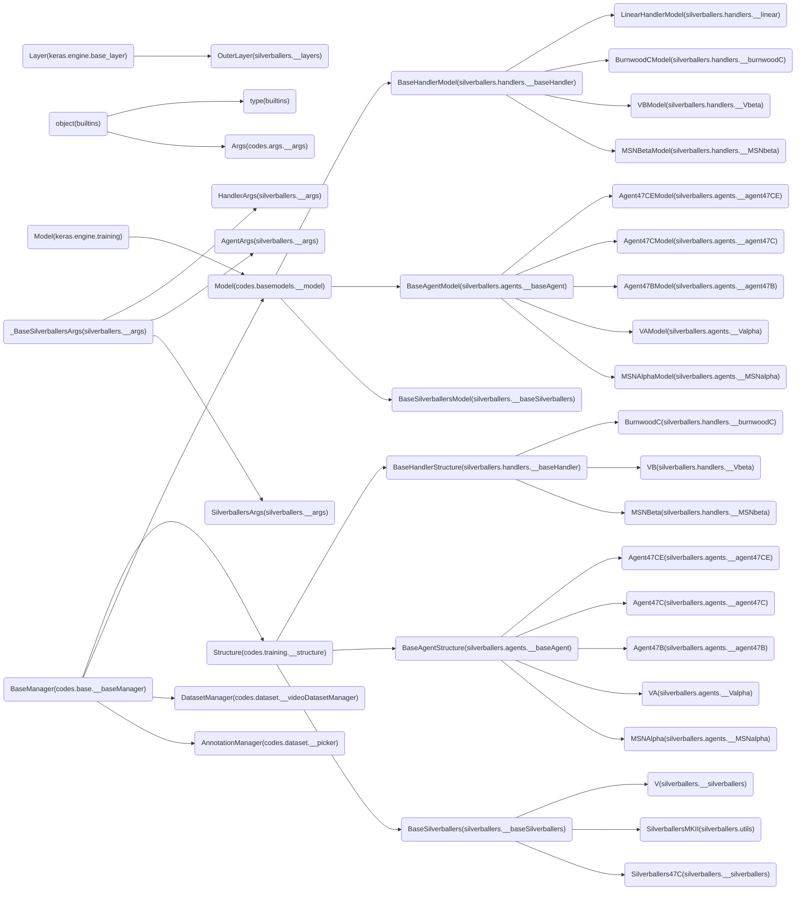

<!--
 * @Author: Conghao Wong
 * @Date: 2022-06-23 09:30:53
 * @LastEditors: Conghao Wong
 * @LastEditTime: 2022-06-23 09:30:53
 * @Description: file content
 * @Github: https://github.com/cocoon2wong
 * Copyright 2022 Conghao Wong, All Rights Reserved.
-->

# Classes Used in This Project

Packages:

```mermaid
    graph LR
        codes.base.__baseManager_BaseManager("BaseManager(codes.base.__baseManager)") --> codes.vis.__vis_Visualization("Visualization(codes.vis.__vis)")
        builtins_object("object(builtins)") --> builtins_type("type(builtins)")
        builtins_object("object(builtins)") --> codes.dataset.__videoClip_VideoClip("VideoClip(codes.dataset.__videoClip)")
        codes.base.__baseManager__BaseManager("_BaseManager(codes.base.__baseManager)") --> codes.base.__baseManager_BaseManager("BaseManager(codes.base.__baseManager)")
        codes.base.__baseManager_BaseManager("BaseManager(codes.base.__baseManager)") --> codes.dataset.__picker_AnnotationManager("AnnotationManager(codes.dataset.__picker)")
        builtins_object("object(builtins)") --> codes.dataset.__agent_Agent("Agent(codes.dataset.__agent)")
        codes.vis.__helper_BaseVisHelper("BaseVisHelper(codes.vis.__helper)") --> codes.vis.__helper_CoordinateHelper("CoordinateHelper(codes.vis.__helper)")
        codes.vis.__helper_BaseVisHelper("BaseVisHelper(codes.vis.__helper)") --> codes.vis.__helper_BoundingboxHelper("BoundingboxHelper(codes.vis.__helper)")
        builtins_object("object(builtins)") --> codes.vis.__helper_BaseVisHelper("BaseVisHelper(codes.vis.__helper)")
        codes.base.__baseManager_BaseManager("BaseManager(codes.base.__baseManager)") --> codes.training.loss.__lossManager_LossManager("LossManager(codes.training.loss.__lossManager)")
        codes.base.__baseManager_BaseManager("BaseManager(codes.base.__baseManager)") --> codes.training.__structure_Structure("Structure(codes.training.__structure)")
        keras.engine.training_Model("Model(keras.engine.training)") --> codes.basemodels.__model_Model("Model(codes.basemodels.__model)")
        codes.base.__baseManager_BaseManager("BaseManager(codes.base.__baseManager)") --> codes.basemodels.__model_Model("Model(codes.basemodels.__model)")
        codes.base.__baseManager_BaseManager("BaseManager(codes.base.__baseManager)") --> codes.dataset.__videoDatasetManager_DatasetManager("DatasetManager(codes.dataset.__videoDatasetManager)")
        builtins_object("object(builtins)") --> codes.args.__args_Args("Args(codes.args.__args)")
        codes.base.__baseManager_BaseManager("BaseManager(codes.base.__baseManager)") --> codes.dataset.__agentManager_AgentManager("AgentManager(codes.dataset.__agentManager)")
        builtins_object("object(builtins)") --> codes.basemodels.wavetf._wavetf_WaveTFFactory("WaveTFFactory(codes.basemodels.wavetf._wavetf)")
        codes.basemodels.layers.__transformLayers__BaseTransformLayer("_BaseTransformLayer(codes.basemodels.layers.__transformLayers)") --> codes.basemodels.layers.__transformLayers_NoneTransformLayer("NoneTransformLayer(codes.basemodels.layers.__transformLayers)")
        codes.basemodels.layers.__transformLayers__BaseTransformLayer("_BaseTransformLayer(codes.basemodels.layers.__transformLayers)") --> codes.basemodels.layers.__transformLayers_InverseHaar1D("InverseHaar1D(codes.basemodels.layers.__transformLayers)")
        codes.basemodels.layers.__transformLayers__BaseTransformLayer("_BaseTransformLayer(codes.basemodels.layers.__transformLayers)") --> codes.basemodels.layers.__transformLayers_InverseDB2_1D("InverseDB2_1D(codes.basemodels.layers.__transformLayers)")
        codes.basemodels.layers.__transformLayers__BaseTransformLayer("_BaseTransformLayer(codes.basemodels.layers.__transformLayers)") --> codes.basemodels.layers.__transformLayers_IFFTLayer("IFFTLayer(codes.basemodels.layers.__transformLayers)")
        codes.basemodels.layers.__transformLayers__BaseTransformLayer("_BaseTransformLayer(codes.basemodels.layers.__transformLayers)") --> codes.basemodels.layers.__transformLayers_Haar1D("Haar1D(codes.basemodels.layers.__transformLayers)")
        codes.basemodels.layers.__transformLayers__BaseTransformLayer("_BaseTransformLayer(codes.basemodels.layers.__transformLayers)") --> codes.basemodels.layers.__transformLayers_FFTLayer("FFTLayer(codes.basemodels.layers.__transformLayers)")
        codes.basemodels.layers.__transformLayers__BaseTransformLayer("_BaseTransformLayer(codes.basemodels.layers.__transformLayers)") --> codes.basemodels.layers.__transformLayers_DB2_1D("DB2_1D(codes.basemodels.layers.__transformLayers)")
        keras.engine.base_layer_Layer("Layer(keras.engine.base_layer)") --> codes.basemodels.layers.__traj_TrajEncoding("TrajEncoding(codes.basemodels.layers.__traj)")
        keras.engine.base_layer_Layer("Layer(keras.engine.base_layer)") --> codes.basemodels.layers.__traj_ContextEncoding("ContextEncoding(codes.basemodels.layers.__traj)")
        codes.basemodels.layers.__linear_LinearLayer("LinearLayer(codes.basemodels.layers.__linear)") --> codes.basemodels.layers.__linear_LinearLayerND("LinearLayerND(codes.basemodels.layers.__linear)")
        keras.engine.base_layer_Layer("Layer(keras.engine.base_layer)") --> codes.basemodels.layers.__linear_LinearLayer("LinearLayer(codes.basemodels.layers.__linear)")
        keras.engine.base_layer_Layer("Layer(keras.engine.base_layer)") --> codes.basemodels.layers.__linear_LinearInterpolation("LinearInterpolation(codes.basemodels.layers.__linear)")
        keras.engine.base_layer_Layer("Layer(keras.engine.base_layer)") --> codes.basemodels.layers.__graphConv_GraphConv("GraphConv(codes.basemodels.layers.__graphConv)")
        codes.basemodels.__model_Model("Model(codes.basemodels.__model)") --> codes.models.__linear_LinearModel("LinearModel(codes.models.__linear)")
        codes.training.__structure_Structure("Structure(codes.training.__structure)") --> codes.models.__linear_Linear("Linear(codes.models.__linear)")
        codes.base.__baseManager_BaseManager("BaseManager(codes.base.__baseManager)") --> codes.dataset.__videoClipManager_VideoClipManager("VideoClipManager(codes.dataset.__videoClipManager)")
        builtins_FileNotFoundError("FileNotFoundError(builtins)") --> codes.dataset.__agentManager_TrajMapNotFoundError("TrajMapNotFoundError(codes.dataset.__agentManager)")
        builtins_object("object(builtins)") --> codes.dataset.__videoDataset_Dataset("Dataset(codes.dataset.__videoDataset)")
        builtins_object("object(builtins)") --> codes.dataset.__trajectory_Trajectory("Trajectory(codes.dataset.__trajectory)")
        builtins_object("object(builtins)") --> codes.dataset.__picker_Picker("Picker(codes.dataset.__picker)")
        codes.base.__baseManager_BaseManager("BaseManager(codes.base.__baseManager)") --> codes.dataset.__maps_MapManager("MapManager(codes.dataset.__maps)")
        tqdm.utils_Comparable("Comparable(tqdm.utils)") --> tqdm.std_tqdm("tqdm(tqdm.std)")
        keras.engine.base_layer_Layer("Layer(keras.engine.base_layer)") --> codes.basemodels.wavetf._base_wavelets_InvWaveLayer2D("InvWaveLayer2D(codes.basemodels.wavetf._base_wavelets)")
        keras.engine.base_layer_Layer("Layer(keras.engine.base_layer)") --> codes.basemodels.wavetf._base_wavelets_InvWaveLayer1D("InvWaveLayer1D(codes.basemodels.wavetf._base_wavelets)")
        codes.basemodels.wavetf._base_wavelets_InvWaveLayer2D("InvWaveLayer2D(codes.basemodels.wavetf._base_wavelets)") --> codes.basemodels.wavetf._haar_conv_InvHaarWaveLayer2D("InvHaarWaveLayer2D(codes.basemodels.wavetf._haar_conv)")
        codes.basemodels.wavetf._base_wavelets_InvWaveLayer1D("InvWaveLayer1D(codes.basemodels.wavetf._base_wavelets)") --> codes.basemodels.wavetf._haar_mm_InvHaarWaveLayer1D("InvHaarWaveLayer1D(codes.basemodels.wavetf._haar_mm)")
        codes.basemodels.wavetf._base_wavelets_InvWaveLayer2D("InvWaveLayer2D(codes.basemodels.wavetf._base_wavelets)") --> codes.basemodels.wavetf._daubachies_conv_InvDaubWaveLayer2D("InvDaubWaveLayer2D(codes.basemodels.wavetf._daubachies_conv)")
        codes.basemodels.wavetf._base_wavelets_InvWaveLayer1D("InvWaveLayer1D(codes.basemodels.wavetf._base_wavelets)") --> codes.basemodels.wavetf._daubachies_conv_InvDaubWaveLayer1D("InvDaubWaveLayer1D(codes.basemodels.wavetf._daubachies_conv)")
        codes.basemodels.wavetf._base_wavelets_DirWaveLayer2D("DirWaveLayer2D(codes.basemodels.wavetf._base_wavelets)") --> codes.basemodels.wavetf._haar_conv_HaarWaveLayer2D("HaarWaveLayer2D(codes.basemodels.wavetf._haar_conv)")
        codes.basemodels.wavetf._base_wavelets_DirWaveLayer1D("DirWaveLayer1D(codes.basemodels.wavetf._base_wavelets)") --> codes.basemodels.wavetf._haar_mm_HaarWaveLayer1D("HaarWaveLayer1D(codes.basemodels.wavetf._haar_mm)")
        keras.engine.base_layer_Layer("Layer(keras.engine.base_layer)") --> codes.basemodels.wavetf._base_wavelets_DirWaveLayer2D("DirWaveLayer2D(codes.basemodels.wavetf._base_wavelets)")
        keras.engine.base_layer_Layer("Layer(keras.engine.base_layer)") --> codes.basemodels.wavetf._base_wavelets_DirWaveLayer1D("DirWaveLayer1D(codes.basemodels.wavetf._base_wavelets)")
        codes.basemodels.wavetf._base_wavelets_DirWaveLayer2D("DirWaveLayer2D(codes.basemodels.wavetf._base_wavelets)") --> codes.basemodels.wavetf._daubachies_conv_DaubWaveLayer2D("DaubWaveLayer2D(codes.basemodels.wavetf._daubachies_conv)")
        codes.basemodels.wavetf._base_wavelets_DirWaveLayer1D("DirWaveLayer1D(codes.basemodels.wavetf._base_wavelets)") --> codes.basemodels.wavetf._daubachies_conv_DaubWaveLayer1D("DaubWaveLayer1D(codes.basemodels.wavetf._daubachies_conv)")
        codes.basemodels.wavetf._base_wavelets_InvWaveLayer2D("InvWaveLayer2D(codes.basemodels.wavetf._base_wavelets)") --> codes.basemodels.wavetf._haar_mm_InvHaarWaveLayer2D("InvHaarWaveLayer2D(codes.basemodels.wavetf._haar_mm)")
        codes.basemodels.wavetf._base_wavelets_DirWaveLayer2D("DirWaveLayer2D(codes.basemodels.wavetf._base_wavelets)") --> codes.basemodels.wavetf._haar_mm_HaarWaveLayer2D("HaarWaveLayer2D(codes.basemodels.wavetf._haar_mm)")
        codes.basemodels.wavetf._base_wavelets_InvWaveLayer1D("InvWaveLayer1D(codes.basemodels.wavetf._base_wavelets)") --> codes.basemodels.wavetf._haar_conv_InvHaarWaveLayer1D("InvHaarWaveLayer1D(codes.basemodels.wavetf._haar_conv)")
        codes.basemodels.wavetf._base_wavelets_DirWaveLayer1D("DirWaveLayer1D(codes.basemodels.wavetf._base_wavelets)") --> codes.basemodels.wavetf._haar_conv_HaarWaveLayer1D("HaarWaveLayer1D(codes.basemodels.wavetf._haar_conv)")
        keras.engine.base_layer_Layer("Layer(keras.engine.base_layer)") --> codes.basemodels.transformer._utils_MultiHeadAttention("MultiHeadAttention(codes.basemodels.transformer._utils)")
        keras.engine.training_Model("Model(keras.engine.training)") --> codes.basemodels.transformer._transformer_TransformerEncoder("TransformerEncoder(codes.basemodels.transformer._transformer)")
        keras.engine.training_Model("Model(keras.engine.training)") --> codes.basemodels.transformer._transformer_Transformer("Transformer(codes.basemodels.transformer._transformer)")
        keras.engine.base_layer_Layer("Layer(keras.engine.base_layer)") --> codes.basemodels.transformer._transformer_EncoderLayer("EncoderLayer(codes.basemodels.transformer._transformer)")
        keras.engine.base_layer_Layer("Layer(keras.engine.base_layer)") --> codes.basemodels.transformer._transformer_Encoder("Encoder(codes.basemodels.transformer._transformer)")
        keras.engine.base_layer_Layer("Layer(keras.engine.base_layer)") --> codes.basemodels.transformer._transformer_DecoderLayer("DecoderLayer(codes.basemodels.transformer._transformer)")
        keras.engine.base_layer_Layer("Layer(keras.engine.base_layer)") --> codes.basemodels.transformer._transformer_Decoder("Decoder(codes.basemodels.transformer._transformer)")
        codes.basemodels.process.__base_BaseProcessLayer("BaseProcessLayer(codes.basemodels.process.__base)") --> codes.basemodels.process.__scale_Scale("Scale(codes.basemodels.process.__scale)")
        keras.engine.base_layer_Layer("Layer(keras.engine.base_layer)") --> codes.basemodels.process.__base_BaseProcessLayer("BaseProcessLayer(codes.basemodels.process.__base)")
        codes.basemodels.process.__base_BaseProcessLayer("BaseProcessLayer(codes.basemodels.process.__base)") --> codes.basemodels.process.__rotate_Rotate("Rotate(codes.basemodels.process.__rotate)")
        codes.basemodels.process.__base_BaseProcessLayer("BaseProcessLayer(codes.basemodels.process.__base)") --> codes.basemodels.process.__move_Move("Move(codes.basemodels.process.__move)")
        keras.engine.training_Model("Model(keras.engine.training)") --> codes.basemodels.process.__base_ProcessModel("ProcessModel(codes.basemodels.process.__base)")
        typing__Final("_Final(typing)") --> typing_TypeVar("TypeVar(typing)")
        typing__Immutable("_Immutable(typing)") --> typing_TypeVar("TypeVar(typing)")
```

<!-- GRAPH BEGINS HERE -->

<!-- GRAPH ENDS HERE -->