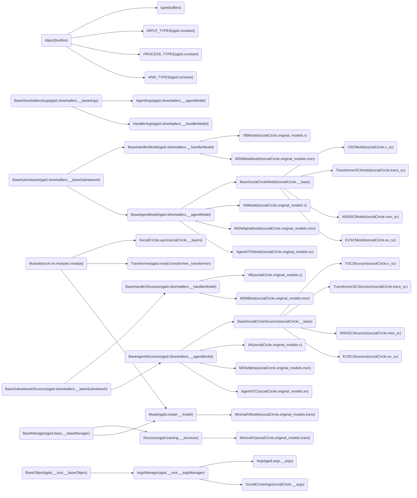

<!--
 * @Author: Conghao Wong
 * @Date: 2022-06-23 09:30:53
 * @LastEditors: Conghao Wong
 * @LastEditTime: 2022-06-23 09:30:53
 * @Description: file content
 * @Github: https://github.com/cocoon2wong
 * Copyright 2022 Conghao Wong, All Rights Reserved.
-->

# Classes Used in This Project

Packages:

<!-- GRAPH BEGINS HERE -->
```mermaid
    graph LR
        typing__Final("_Final(typing)") --> typing_TypeVar("TypeVar(typing)")
        typing__Immutable("_Immutable(typing)") --> typing_TypeVar("TypeVar(typing)")
        typing__BoundVarianceMixin("_BoundVarianceMixin(typing)") --> typing_TypeVar("TypeVar(typing)")
        typing__PickleUsingNameMixin("_PickleUsingNameMixin(typing)") --> typing_TypeVar("TypeVar(typing)")
        builtins_object("object(builtins)") --> builtins_type("type(builtins)")
        qpid.training.loss.__layers_BaseLossLayer("BaseLossLayer(qpid.training.loss.__layers)") --> qpid.training.loss.__layers_l2("l2(qpid.training.loss.__layers)")
        qpid.training.loss.__layers_avgCenter("avgCenter(qpid.training.loss.__layers)") --> qpid.training.loss.__layers_finalCenter("finalCenter(qpid.training.loss.__layers)")
        qpid.training.loss.__layers_BaseLossLayer("BaseLossLayer(qpid.training.loss.__layers)") --> qpid.training.loss.__layers_avgCenter("avgCenter(qpid.training.loss.__layers)")
        qpid.base.__baseManager_BaseManager("BaseManager(qpid.base.__baseManager)") --> qpid.training.loss.__lossManager_LossManager("LossManager(qpid.training.loss.__lossManager)")
        qpid.__root.__baseObject_BaseObject("BaseObject(qpid.__root.__baseObject)") --> qpid.base.__baseManager_BaseManager("BaseManager(qpid.base.__baseManager)")
        torch.nn.modules.module_Module("Module(torch.nn.modules.module)") --> qpid.training.loss.__layers_BaseLossLayer("BaseLossLayer(qpid.training.loss.__layers)")
        qpid.base.__baseManager_BaseManager("BaseManager(qpid.base.__baseManager)") --> qpid.dataset.__base.__picker_AnnotationManager("AnnotationManager(qpid.dataset.__base.__picker)")
        builtins_object("object(builtins)") --> qpid.dataset.__base.__picker_Annotation("Annotation(qpid.dataset.__base.__picker)")
        qpid.training.loss.__layers_ADE("ADE(qpid.training.loss.__layers)") --> qpid.training.loss.__layers_FDE("FDE(qpid.training.loss.__layers)")
        qpid.training.loss.__layers_BaseLossLayer("BaseLossLayer(qpid.training.loss.__layers)") --> qpid.training.loss.__layers_ADE("ADE(qpid.training.loss.__layers)")
        qpid.training.loss.__iou_AIOU("AIOU(qpid.training.loss.__iou)") --> qpid.training.loss.__iou_FIOU("FIOU(qpid.training.loss.__iou)")
        qpid.training.loss.__layers_BaseLossLayer("BaseLossLayer(qpid.training.loss.__layers)") --> qpid.training.loss.__iou_AIOU("AIOU(qpid.training.loss.__iou)")
        builtins_object("object(builtins)") --> torch.utils.tensorboard.writer_SummaryWriter("SummaryWriter(torch.utils.tensorboard.writer)")
        qpid.base.__baseManager_BaseManager("BaseManager(qpid.base.__baseManager)") --> qpid.training.__structure_Structure("Structure(qpid.training.__structure)")
        qpid.__root.__argsManager_ArgsManager("ArgsManager(qpid.__root.__argsManager)") --> qpid.args.__args_Args("Args(qpid.args.__args)")
        qpid.base.__baseManager_BaseManager("BaseManager(qpid.base.__baseManager)") --> qpid.dataset.__splitManager_SplitManager("SplitManager(qpid.dataset.__splitManager)")
        builtins_object("object(builtins)") --> qpid.constant_STRUCTURE_STATUS("STRUCTURE_STATUS(qpid.constant)")
        torch.nn.modules.module_Module("Module(torch.nn.modules.module)") --> qpid.model.__model_Model("Model(qpid.model.__model)")
        qpid.base.__baseManager_BaseManager("BaseManager(qpid.base.__baseManager)") --> qpid.model.__model_Model("Model(qpid.model.__model)")
        builtins_object("object(builtins)") --> qpid.constant_INPUT_TYPES("INPUT_TYPES(qpid.constant)")
        typing_Generic("Generic(typing)") --> torch.utils.data.dataloader_DataLoader("DataLoader(torch.utils.data.dataloader)")
        builtins_object("object(builtins)") --> typing_Any("Any(typing)")
        qpid.base.__baseManager_BaseManager("BaseManager(qpid.base.__baseManager)") --> qpid.dataset.__agentManager_AgentManager("AgentManager(qpid.dataset.__agentManager)")
        builtins_object("object(builtins)") --> qpid.constant_ANN_TYPES("ANN_TYPES(qpid.constant)")
        torch.nn.modules.module_Module("Module(torch.nn.modules.module)") --> qpid.model.layers.interpolation.newton_NewtonInterpolation("NewtonInterpolation(qpid.model.layers.interpolation.newton)")
        torch.nn.modules.module_Module("Module(torch.nn.modules.module)") --> qpid.model.layers.interpolation.linear_speed_LinearSpeedInterpolation("LinearSpeedInterpolation(qpid.model.layers.interpolation.linear_speed)")
        torch.nn.modules.module_Module("Module(torch.nn.modules.module)") --> qpid.model.layers.interpolation.linear_acc_LinearAccInterpolation("LinearAccInterpolation(qpid.model.layers.interpolation.linear_acc)")
        torch.nn.modules.module_Module("Module(torch.nn.modules.module)") --> qpid.model.layers.interpolation.linear_LinearPositionInterpolation("LinearPositionInterpolation(qpid.model.layers.interpolation.linear)")
        qpid.silverballers.interpHandlers.__baseInterpHandler__BaseInterpHandlerModel("_BaseInterpHandlerModel(qpid.silverballers.interpHandlers.__baseInterpHandler)") --> qpid.silverballers.interpHandlers.__newton_NewtonHandlerModel("NewtonHandlerModel(qpid.silverballers.interpHandlers.__newton)")
        qpid.silverballers.interpHandlers.__baseInterpHandler__BaseInterpHandlerModel("_BaseInterpHandlerModel(qpid.silverballers.interpHandlers.__baseInterpHandler)") --> qpid.silverballers.interpHandlers.__linear_LinearSpeedHandlerModel("LinearSpeedHandlerModel(qpid.silverballers.interpHandlers.__linear)")
        qpid.silverballers.interpHandlers.__baseInterpHandler__BaseInterpHandlerModel("_BaseInterpHandlerModel(qpid.silverballers.interpHandlers.__baseInterpHandler)") --> qpid.silverballers.interpHandlers.__linear_LinearHandlerModel("LinearHandlerModel(qpid.silverballers.interpHandlers.__linear)")
        qpid.silverballers.interpHandlers.__baseInterpHandler__BaseInterpHandlerModel("_BaseInterpHandlerModel(qpid.silverballers.interpHandlers.__baseInterpHandler)") --> qpid.silverballers.interpHandlers.__linear_LinearAccHandlerModel("LinearAccHandlerModel(qpid.silverballers.interpHandlers.__linear)")
        qpid.silverballers.__baseArgs_BaseSilverballersArgs("BaseSilverballersArgs(qpid.silverballers.__baseArgs)") --> qpid.silverballers.__handlerModel_HandlerArgs("HandlerArgs(qpid.silverballers.__handlerModel)")
        qpid.silverballers.__baseSubnetwork_BaseSubnetwork("BaseSubnetwork(qpid.silverballers.__baseSubnetwork)") --> qpid.silverballers.__handlerModel_BaseHandlerModel("BaseHandlerModel(qpid.silverballers.__handlerModel)")
        builtins_object("object(builtins)") --> qpid.constant_INTERPOLATION_TYPES("INTERPOLATION_TYPES(qpid.constant)")
        qpid.training.loss.__layers_l2("l2(qpid.training.loss.__layers)") --> qpid.silverballers.__loss_keyl2_past("keyl2_past(qpid.silverballers.__loss)")
        qpid.training.loss.__layers_l2("l2(qpid.training.loss.__layers)") --> qpid.silverballers.__loss_keyl2("keyl2(qpid.silverballers.__loss)")
        qpid.training.loss.__layers_ADE("ADE(qpid.training.loss.__layers)") --> qpid.silverballers.__loss_avgKey("avgKey(qpid.silverballers.__loss)")
        qpid.training.__structure_Structure("Structure(qpid.training.__structure)") --> qpid.silverballers.__baseSubnetwork_BaseSubnetworkStructure("BaseSubnetworkStructure(qpid.silverballers.__baseSubnetwork)")
        qpid.args.__args_Args("Args(qpid.args.__args)") --> qpid.silverballers.__baseArgs_BaseSilverballersArgs("BaseSilverballersArgs(qpid.silverballers.__baseArgs)")
        qpid.silverballers.__baseArgs_BaseSilverballersArgs("BaseSilverballersArgs(qpid.silverballers.__baseArgs)") --> qpid.silverballers.__baseArgs_SilverballersArgs("SilverballersArgs(qpid.silverballers.__baseArgs)")
        qpid.model.__model_Model("Model(qpid.model.__model)") --> qpid.silverballers.__baseSubnetwork_BaseSubnetwork("BaseSubnetwork(qpid.silverballers.__baseSubnetwork)")
        qpid.silverballers.__baseSubnetwork_BaseSubnetworkStructure("BaseSubnetworkStructure(qpid.silverballers.__baseSubnetwork)") --> qpid.silverballers.__handlerModel_BaseHandlerStructure("BaseHandlerStructure(qpid.silverballers.__handlerModel)")
        builtins_object("object(builtins)") --> qpid.constant_PROCESS_TYPES("PROCESS_TYPES(qpid.constant)")
        qpid.silverballers.__baseSubnetwork_BaseSubnetworkStructure("BaseSubnetworkStructure(qpid.silverballers.__baseSubnetwork)") --> qpid.silverballers.__agentModel_BaseAgentStructure("BaseAgentStructure(qpid.silverballers.__agentModel)")
        qpid.silverballers.__baseArgs_BaseSilverballersArgs("BaseSilverballersArgs(qpid.silverballers.__baseArgs)") --> qpid.silverballers.__agentModel_AgentArgs("AgentArgs(qpid.silverballers.__agentModel)")
        qpid.silverballers.__baseSubnetwork_BaseSubnetwork("BaseSubnetwork(qpid.silverballers.__baseSubnetwork)") --> qpid.silverballers.__agentModel_BaseAgentModel("BaseAgentModel(qpid.silverballers.__agentModel)")
        builtins_object("object(builtins)") --> qpid.silverballers.__MKII_utils_SILVERBALLERS_DICT("SILVERBALLERS_DICT(qpid.silverballers.__MKII_utils)")
        qpid.model.__model_Model("Model(qpid.model.__model)") --> qpid.silverballers.__MKII_model_SilverballersModel("SilverballersModel(qpid.silverballers.__MKII_model)")
        qpid.training.__structure_Structure("Structure(qpid.training.__structure)") --> qpid.silverballers.__MKII_model_SilverballersMKII("SilverballersMKII(qpid.silverballers.__MKII_model)")
        builtins_object("object(builtins)") --> qpid.__root.__baseObject_BaseObject("BaseObject(qpid.__root.__baseObject)")
        torch.nn.modules.module_Module("Module(torch.nn.modules.module)") --> qpid.model.transformer._utils_MultiHeadAttention("MultiHeadAttention(qpid.model.transformer._utils)")
        torch.nn.modules.module_Module("Module(torch.nn.modules.module)") --> qpid.model.transformer._transformer_TransformerEncoder("TransformerEncoder(qpid.model.transformer._transformer)")
        torch.nn.modules.module_Module("Module(torch.nn.modules.module)") --> qpid.model.transformer._transformer_Transformer("Transformer(qpid.model.transformer._transformer)")
        torch.nn.modules.module_Module("Module(torch.nn.modules.module)") --> qpid.model.transformer._transformer_EncoderLayer("EncoderLayer(qpid.model.transformer._transformer)")
        torch.nn.modules.module_Module("Module(torch.nn.modules.module)") --> qpid.model.transformer._transformer_Encoder("Encoder(qpid.model.transformer._transformer)")
        torch.nn.modules.module_Module("Module(torch.nn.modules.module)") --> qpid.model.layers.basic_Dropout("Dropout(qpid.model.layers.basic)")
        torch.nn.modules.module_Module("Module(torch.nn.modules.module)") --> qpid.model.transformer._transformer_DecoderLayer("DecoderLayer(qpid.model.transformer._transformer)")
        torch.nn.modules.module_Module("Module(torch.nn.modules.module)") --> qpid.model.transformer._transformer_Decoder("Decoder(qpid.model.transformer._transformer)")
        qpid.model.process.__base_BaseProcessLayer("BaseProcessLayer(qpid.model.process.__base)") --> qpid.model.process.__scale_Scale("Scale(qpid.model.process.__scale)")
        builtins_object("object(builtins)") --> qpid.constant_OUTPUT_TYPES("OUTPUT_TYPES(qpid.constant)")
        torch.nn.modules.module_Module("Module(torch.nn.modules.module)") --> qpid.model.process.__base_BaseProcessLayer("BaseProcessLayer(qpid.model.process.__base)")
        qpid.__root.__baseObject_BaseObject("BaseObject(qpid.__root.__baseObject)") --> qpid.model.process.__base_BaseProcessLayer("BaseProcessLayer(qpid.model.process.__base)")
        qpid.model.process.__base_BaseProcessLayer("BaseProcessLayer(qpid.model.process.__base)") --> qpid.model.process.__rotate_Rotate("Rotate(qpid.model.process.__rotate)")
        torch.nn.modules.module_Module("Module(torch.nn.modules.module)") --> qpid.model.process.__processModel_ProcessModel("ProcessModel(qpid.model.process.__processModel)")
        qpid.model.process.__base_BaseProcessLayer("BaseProcessLayer(qpid.model.process.__base)") --> qpid.model.process.__move_Move("Move(qpid.model.process.__move)")
        builtins_object("object(builtins)") --> qpid.model.layers.transfroms.wavetf._wavetf_WaveTFFactory("WaveTFFactory(qpid.model.layers.transfroms.wavetf._wavetf)")
        qpid.model.layers.transfroms.wavetf._base_wavelets_InvWaveLayer1D("InvWaveLayer1D(qpid.model.layers.transfroms.wavetf._base_wavelets)") --> qpid.model.layers.transfroms.wavetf._haar_mm_InvHaarWaveLayer1D("InvHaarWaveLayer1D(qpid.model.layers.transfroms.wavetf._haar_mm)")
        qpid.model.layers.transfroms.wavetf._base_wavelets_InvWaveLayer1D("InvWaveLayer1D(qpid.model.layers.transfroms.wavetf._base_wavelets)") --> qpid.model.layers.transfroms.wavetf._daubachies_conv_InvDaubWaveLayer1D("InvDaubWaveLayer1D(qpid.model.layers.transfroms.wavetf._daubachies_conv)")
        qpid.model.layers.transfroms.wavetf._base_wavelets_DirWaveLayer1D("DirWaveLayer1D(qpid.model.layers.transfroms.wavetf._base_wavelets)") --> qpid.model.layers.transfroms.wavetf._haar_mm_HaarWaveLayer1D("HaarWaveLayer1D(qpid.model.layers.transfroms.wavetf._haar_mm)")
        qpid.model.layers.transfroms.wavetf._base_wavelets_DirWaveLayer1D("DirWaveLayer1D(qpid.model.layers.transfroms.wavetf._base_wavelets)") --> qpid.model.layers.transfroms.wavetf._daubachies_conv_DaubWaveLayer1D("DaubWaveLayer1D(qpid.model.layers.transfroms.wavetf._daubachies_conv)")
        torch.nn.modules.module_Module("Module(torch.nn.modules.module)") --> qpid.model.layers.transfroms.wavetf._base_wavelets_InvWaveLayer1D("InvWaveLayer1D(qpid.model.layers.transfroms.wavetf._base_wavelets)")
        torch.nn.modules.module_Module("Module(torch.nn.modules.module)") --> qpid.model.layers.transfroms.wavetf._base_wavelets_DirWaveLayer1D("DirWaveLayer1D(qpid.model.layers.transfroms.wavetf._base_wavelets)")
        qpid.model.layers.transfroms.__base__BaseTransformLayer("_BaseTransformLayer(qpid.model.layers.transfroms.__base)") --> qpid.model.layers.transfroms.wavelets_InverseHaar1D("InverseHaar1D(qpid.model.layers.transfroms.wavelets)")
        qpid.model.layers.transfroms.__base__BaseTransformLayer("_BaseTransformLayer(qpid.model.layers.transfroms.__base)") --> qpid.model.layers.transfroms.wavelets_InverseDB2_1D("InverseDB2_1D(qpid.model.layers.transfroms.wavelets)")
        qpid.model.layers.transfroms.__base__BaseTransformLayer("_BaseTransformLayer(qpid.model.layers.transfroms.__base)") --> qpid.model.layers.transfroms.wavelets_Haar1D("Haar1D(qpid.model.layers.transfroms.wavelets)")
        qpid.model.layers.transfroms.__base__BaseTransformLayer("_BaseTransformLayer(qpid.model.layers.transfroms.__base)") --> qpid.model.layers.transfroms.wavelets_DB2_1D("DB2_1D(qpid.model.layers.transfroms.wavelets)")
        qpid.model.layers.transfroms.__base__BaseTransformLayer("_BaseTransformLayer(qpid.model.layers.transfroms.__base)") --> qpid.model.layers.transfroms.fft_IFFTLayer("IFFTLayer(qpid.model.layers.transfroms.fft)")
        qpid.model.layers.transfroms.__base__BaseTransformLayer("_BaseTransformLayer(qpid.model.layers.transfroms.__base)") --> qpid.model.layers.transfroms.fft_IFFT2Dlayer("IFFT2Dlayer(qpid.model.layers.transfroms.fft)")
        qpid.model.layers.transfroms.__base__BaseTransformLayer("_BaseTransformLayer(qpid.model.layers.transfroms.__base)") --> qpid.model.layers.transfroms.fft_FFTLayer("FFTLayer(qpid.model.layers.transfroms.fft)")
        qpid.model.layers.transfroms.__base__BaseTransformLayer("_BaseTransformLayer(qpid.model.layers.transfroms.__base)") --> qpid.model.layers.transfroms.fft_FFT2DLayer("FFT2DLayer(qpid.model.layers.transfroms.fft)")
        qpid.model.layers.transfroms.__base__BaseTransformLayer("_BaseTransformLayer(qpid.model.layers.transfroms.__base)") --> qpid.model.layers.transfroms.__base_NoneTransformLayer("NoneTransformLayer(qpid.model.layers.transfroms.__base)")
        qpid.model.layers.pooling__BasePooling2D("_BasePooling2D(qpid.model.layers.pooling)") --> qpid.model.layers.pooling_MaxPooling2D("MaxPooling2D(qpid.model.layers.pooling)")
        torch.nn.modules.pooling__MaxPoolNd("_MaxPoolNd(torch.nn.modules.pooling)") --> torch.nn.modules.pooling_MaxPool2d("MaxPool2d(torch.nn.modules.pooling)")
        torch.nn.modules.module_Module("Module(torch.nn.modules.module)") --> qpid.model.layers.outer_product_OuterLayer("OuterLayer(qpid.model.layers.outer_product)")
        qpid.model.layers.linear_pred_LinearLayer("LinearLayer(qpid.model.layers.linear_pred)") --> qpid.model.layers.linear_pred_LinearLayerND("LinearLayerND(qpid.model.layers.linear_pred)")
        torch.nn.modules.module_Module("Module(torch.nn.modules.module)") --> qpid.model.layers.linear_pred_LinearLayer("LinearLayer(qpid.model.layers.linear_pred)")
        torch.nn.modules.module_Module("Module(torch.nn.modules.module)") --> qpid.model.layers.graph_conv_GraphConv("GraphConv(qpid.model.layers.graph_conv)")
        torch.nn.modules.module_Module("Module(torch.nn.modules.module)") --> qpid.model.layers.basic_Dense("Dense(qpid.model.layers.basic)")
        torch.nn.modules.module_Module("Module(torch.nn.modules.module)") --> qpid.model.layers.flatten_Flatten("Flatten(qpid.model.layers.flatten)")
        torch.nn.modules.module_Module("Module(torch.nn.modules.module)") --> qpid.model.layers.embedding_TrajEncoding("TrajEncoding(qpid.model.layers.embedding)")
        qpid.__root.__baseObject_BaseObject("BaseObject(qpid.__root.__baseObject)") --> qpid.__root.__argsManager_ArgsManager("ArgsManager(qpid.__root.__argsManager)")
        builtins_object("object(builtins)") --> qpid.constant_ARG_TYPES("ARG_TYPES(qpid.constant)")
        qpid.dataset.__base.__inputObjectManager_BaseInputObjectManager("BaseInputObjectManager(qpid.dataset.__base.__inputObjectManager)") --> qpid.dataset.frame_based.__inputObjectManager_FrameObjectManager("FrameObjectManager(qpid.dataset.frame_based.__inputObjectManager)")
        qpid.dataset.__base.__inputObject_BaseInputObject("BaseInputObject(qpid.dataset.__base.__inputObject)") --> qpid.dataset.frame_based.__inputObject_Frame("Frame(qpid.dataset.frame_based.__inputObject)")
        qpid.dataset.__base.__inputManager_BaseInputManager("BaseInputManager(qpid.dataset.__base.__inputManager)") --> qpid.dataset.__base.__inputObjectManager_BaseInputObjectManager("BaseInputObjectManager(qpid.dataset.__base.__inputObjectManager)")
        builtins_object("object(builtins)") --> qpid.dataset.__base.__inputObject_BaseInputObject("BaseInputObject(qpid.dataset.__base.__inputObject)")
        qpid.dataset.__base.__filesManager_BaseFilesManager("BaseFilesManager(qpid.dataset.__base.__filesManager)") --> qpid.dataset.frame_based.__filesManager_FrameFilesManager("FrameFilesManager(qpid.dataset.frame_based.__filesManager)")
        qpid.dataset.__base.__inputManager_BaseInputManager("BaseInputManager(qpid.dataset.__base.__inputManager)") --> qpid.dataset.__base.__filesManager_BaseFilesManager("BaseFilesManager(qpid.dataset.__base.__filesManager)")
        builtins_object("object(builtins)") --> qpid.dataset.agent_based.__inputObject_Trajectory("Trajectory(qpid.dataset.agent_based.__inputObject)")
        qpid.dataset.__base.__inputObjectManager_BaseInputObjectManager("BaseInputObjectManager(qpid.dataset.__base.__inputObjectManager)") --> qpid.dataset.agent_based.__inputObjectManager_AgentObjectManager("AgentObjectManager(qpid.dataset.agent_based.__inputObjectManager)")
        qpid.dataset.__base.__inputObject_BaseInputObject("BaseInputObject(qpid.dataset.__base.__inputObject)") --> qpid.dataset.agent_based.__inputObject_Agent("Agent(qpid.dataset.agent_based.__inputObject)")
        qpid.dataset.__base.__filesManager_BaseFilesManager("BaseFilesManager(qpid.dataset.__base.__filesManager)") --> qpid.dataset.agent_based.__filesManager_AgentFilesManager("AgentFilesManager(qpid.dataset.agent_based.__filesManager)")
        qpid.base.__baseManager_BaseManager("BaseManager(qpid.base.__baseManager)") --> qpid.dataset.__splitManager_Clip("Clip(qpid.dataset.__splitManager)")
        qpid.base.__baseManager_BaseManager("BaseManager(qpid.base.__baseManager)") --> qpid.dataset.__base.__inputManager_BaseInputManager("BaseInputManager(qpid.dataset.__base.__inputManager)")
        tqdm.utils_Comparable("Comparable(tqdm.utils)") --> tqdm.std_tqdm("tqdm(tqdm.std)")
        qpid.dataset.__base.__inputManager_BaseInputManager("BaseInputManager(qpid.dataset.__base.__inputManager)") --> qpid.dataset.__base.__inputManager_BaseExtInputManager("BaseExtInputManager(qpid.dataset.__base.__inputManager)")
        torch.utils.data.dataset_Dataset("Dataset(torch.utils.data.dataset)") --> qpid.dataset.__agentManager_TrajectoryDataset("TrajectoryDataset(qpid.dataset.__agentManager)")
        typing_Generic("Generic(typing)") --> torch.utils.data.dataset_Dataset("Dataset(torch.utils.data.dataset)")
        qpid.model.__model_Model("Model(qpid.model.__model)") --> qpid.applications.linear_prediction_LinearModel("LinearModel(qpid.applications.linear_prediction)")
        qpid.args.__args_Args("Args(qpid.args.__args)") --> qpid.applications.linear_prediction_LinearArgs("LinearArgs(qpid.applications.linear_prediction)")
        qpid.training.__structure_Structure("Structure(qpid.training.__structure)") --> qpid.applications.linear_prediction_Linear("Linear(qpid.applications.linear_prediction)")
```

<!-- GRAPH ENDS HERE -->