<!--
 * @Author: Conghao Wong
 * @Date: 2022-06-23 09:30:53
 * @LastEditors: Conghao Wong
 * @LastEditTime: 2022-06-23 09:30:53
 * @Description: file content
 * @Github: https://github.com/cocoon2wong
 * Copyright 2022 Conghao Wong, All Rights Reserved.
-->

# Classes Used in This Project

Packages:

<!-- GRAPH BEGINS HERE -->
```mermaid
    graph LR
        codes.base.__baseManager_BaseManager("BaseManager(codes.base.__baseManager)") --> codes.vis.__vis_Visualization("Visualization(codes.vis.__vis)")
        builtins_object("object(builtins)") --> builtins_type("type(builtins)")
        codes.base.__baseManager_BaseManager("BaseManager(codes.base.__baseManager)") --> codes.dataset.__splitManager_Clip("Clip(codes.dataset.__splitManager)")
        codes.base.__baseObject_BaseObject("BaseObject(codes.base.__baseObject)") --> codes.base.__baseManager_BaseManager("BaseManager(codes.base.__baseManager)")
        codes.base.__baseManager_BaseManager("BaseManager(codes.base.__baseManager)") --> codes.dataset.__base.__picker_AnnotationManager("AnnotationManager(codes.dataset.__base.__picker)")
        codes.dataset.__base.__inputObject_BaseInputObject("BaseInputObject(codes.dataset.__base.__inputObject)") --> codes.dataset.agent_based.__inputObject_Agent("Agent(codes.dataset.agent_based.__inputObject)")
        codes.vis.__helper_BaseVisHelper("BaseVisHelper(codes.vis.__helper)") --> codes.vis.__helper_CoordinateHelper("CoordinateHelper(codes.vis.__helper)")
        codes.vis.__helper_BaseVisHelper("BaseVisHelper(codes.vis.__helper)") --> codes.vis.__helper_BoundingboxHelper("BoundingboxHelper(codes.vis.__helper)")
        builtins_object("object(builtins)") --> codes.vis.__helper_BaseVisHelper("BaseVisHelper(codes.vis.__helper)")
        builtins_object("object(builtins)") --> codes.constant_ANN_TYPES("ANN_TYPES(codes.constant)")
        codes.base.__baseManager_BaseManager("BaseManager(codes.base.__baseManager)") --> codes.training.loss.__lossManager_LossManager("LossManager(codes.training.loss.__lossManager)")
        codes.base.__baseManager_BaseManager("BaseManager(codes.base.__baseManager)") --> codes.training.__structure_Structure("Structure(codes.training.__structure)")
        codes.base.__baseManager_BaseManager("BaseManager(codes.base.__baseManager)") --> codes.dataset.__splitManager_SplitManager("SplitManager(codes.dataset.__splitManager)")
        keras.engine.training_Model("Model(keras.engine.training)") --> codes.basemodels.__model_Model("Model(codes.basemodels.__model)")
        codes.base.__baseManager_BaseManager("BaseManager(codes.base.__baseManager)") --> codes.basemodels.__model_Model("Model(codes.basemodels.__model)")
        builtins_object("object(builtins)") --> codes.constant_INPUT_TYPES("INPUT_TYPES(codes.constant)")
        codes.base.__argsManager_ArgsManager("ArgsManager(codes.base.__argsManager)") --> codes.base.__args_Args("Args(codes.base.__args)")
        builtins_object("object(builtins)") --> codes.dataset.__base.__picker_Annotation("Annotation(codes.dataset.__base.__picker)")
        codes.base.__baseManager_BaseManager("BaseManager(codes.base.__baseManager)") --> codes.dataset.__agentManager_AgentManager("AgentManager(codes.dataset.__agentManager)")
        builtins_object("object(builtins)") --> codes.basemodels.wavetf._wavetf_WaveTFFactory("WaveTFFactory(codes.basemodels.wavetf._wavetf)")
        codes.basemodels.layers.transfroms.__base__BaseTransformLayer("_BaseTransformLayer(codes.basemodels.layers.transfroms.__base)") --> codes.basemodels.layers.transfroms.__wavetf_InverseHaar1D("InverseHaar1D(codes.basemodels.layers.transfroms.__wavetf)")
        codes.basemodels.layers.transfroms.__base__BaseTransformLayer("_BaseTransformLayer(codes.basemodels.layers.transfroms.__base)") --> codes.basemodels.layers.transfroms.__wavetf_InverseDB2_1D("InverseDB2_1D(codes.basemodels.layers.transfroms.__wavetf)")
        codes.basemodels.layers.transfroms.__base__BaseTransformLayer("_BaseTransformLayer(codes.basemodels.layers.transfroms.__base)") --> codes.basemodels.layers.transfroms.__wavetf_Haar1D("Haar1D(codes.basemodels.layers.transfroms.__wavetf)")
        codes.basemodels.layers.transfroms.__base__BaseTransformLayer("_BaseTransformLayer(codes.basemodels.layers.transfroms.__base)") --> codes.basemodels.layers.transfroms.__wavetf_DB2_1D("DB2_1D(codes.basemodels.layers.transfroms.__wavetf)")
        codes.basemodels.layers.transfroms.__base__BaseTransformLayer("_BaseTransformLayer(codes.basemodels.layers.transfroms.__base)") --> codes.basemodels.layers.transfroms.__fft_IFFTLayer("IFFTLayer(codes.basemodels.layers.transfroms.__fft)")
        codes.basemodels.layers.transfroms.__base__BaseTransformLayer("_BaseTransformLayer(codes.basemodels.layers.transfroms.__base)") --> codes.basemodels.layers.transfroms.__fft_IFFT2Dlayer("IFFT2Dlayer(codes.basemodels.layers.transfroms.__fft)")
        codes.basemodels.layers.transfroms.__base__BaseTransformLayer("_BaseTransformLayer(codes.basemodels.layers.transfroms.__base)") --> codes.basemodels.layers.transfroms.__fft_FFTLayer("FFTLayer(codes.basemodels.layers.transfroms.__fft)")
        codes.basemodels.layers.transfroms.__base__BaseTransformLayer("_BaseTransformLayer(codes.basemodels.layers.transfroms.__base)") --> codes.basemodels.layers.transfroms.__fft_FFT2DLayer("FFT2DLayer(codes.basemodels.layers.transfroms.__fft)")
        codes.basemodels.layers.transfroms.__base__BaseTransformLayer("_BaseTransformLayer(codes.basemodels.layers.transfroms.__base)") --> codes.basemodels.layers.transfroms.__dct_IDCTLayer("IDCTLayer(codes.basemodels.layers.transfroms.__dct)")
        codes.basemodels.layers.transfroms.__base__BaseTransformLayer("_BaseTransformLayer(codes.basemodels.layers.transfroms.__base)") --> codes.basemodels.layers.transfroms.__dct_DCTLayer("DCTLayer(codes.basemodels.layers.transfroms.__dct)")
        codes.basemodels.layers.transfroms.__base__BaseTransformLayer("_BaseTransformLayer(codes.basemodels.layers.transfroms.__base)") --> codes.basemodels.layers.transfroms.__base_NoneTransformLayer("NoneTransformLayer(codes.basemodels.layers.transfroms.__base)")
        keras.engine.base_layer_Layer("Layer(keras.engine.base_layer)") --> codes.basemodels.layers.interpolation.__newton_NewtonInterpolation("NewtonInterpolation(codes.basemodels.layers.interpolation.__newton)")
        keras.engine.base_layer_Layer("Layer(keras.engine.base_layer)") --> codes.basemodels.layers.interpolation.__linearSpeed_LinearSpeedInterpolation("LinearSpeedInterpolation(codes.basemodels.layers.interpolation.__linearSpeed)")
        keras.engine.base_layer_Layer("Layer(keras.engine.base_layer)") --> codes.basemodels.layers.interpolation.__linearPos_LinearPositionInterpolation("LinearPositionInterpolation(codes.basemodels.layers.interpolation.__linearPos)")
        keras.engine.base_layer_Layer("Layer(keras.engine.base_layer)") --> codes.basemodels.layers.interpolation.__linearAcc_LinearAccInterpolation("LinearAccInterpolation(codes.basemodels.layers.interpolation.__linearAcc)")
        keras.engine.base_layer_Layer("Layer(keras.engine.base_layer)") --> codes.basemodels.layers.__traj_TrajEncoding("TrajEncoding(codes.basemodels.layers.__traj)")
        keras.engine.base_layer_Layer("Layer(keras.engine.base_layer)") --> codes.basemodels.layers.__traj_ContextEncoding("ContextEncoding(codes.basemodels.layers.__traj)")
        codes.basemodels.layers.__pooling__BasePooling2D("_BasePooling2D(codes.basemodels.layers.__pooling)") --> codes.basemodels.layers.__pooling_MaxPooling2D("MaxPooling2D(codes.basemodels.layers.__pooling)")
        keras.layers.pooling.base_pooling2d_Pooling2D("Pooling2D(keras.layers.pooling.base_pooling2d)") --> keras.layers.pooling.max_pooling2d_MaxPooling2D("MaxPooling2D(keras.layers.pooling.max_pooling2d)")
        builtins_object("object(builtins)") --> codes.base.__baseObject_BaseObject("BaseObject(codes.base.__baseObject)")
        codes.basemodels.layers.__linear_LinearLayer("LinearLayer(codes.basemodels.layers.__linear)") --> codes.basemodels.layers.__linear_LinearLayerND("LinearLayerND(codes.basemodels.layers.__linear)")
        keras.engine.base_layer_Layer("Layer(keras.engine.base_layer)") --> codes.basemodels.layers.__linear_LinearLayer("LinearLayer(codes.basemodels.layers.__linear)")
        keras.engine.base_layer_Layer("Layer(keras.engine.base_layer)") --> codes.basemodels.layers.__linear_LinearInterpolation("LinearInterpolation(codes.basemodels.layers.__linear)")
        keras.engine.base_layer_Layer("Layer(keras.engine.base_layer)") --> codes.basemodels.layers.__graphConv_GraphConv("GraphConv(codes.basemodels.layers.__graphConv)")
        codes.basemodels.__model_Model("Model(codes.basemodels.__model)") --> codes.models.__linear_LinearModel("LinearModel(codes.models.__linear)")
        codes.base.__args_Args("Args(codes.base.__args)") --> codes.models.__linear_LinearArgs("LinearArgs(codes.models.__linear)")
        codes.training.__structure_Structure("Structure(codes.training.__structure)") --> codes.models.__linear_Linear("Linear(codes.models.__linear)")
        codes.dataset.__base.__inputObjectManager_BaseInputObjectManager("BaseInputObjectManager(codes.dataset.__base.__inputObjectManager)") --> codes.dataset.agent_based.__inputObjectManager_TrajectoryManager("TrajectoryManager(codes.dataset.agent_based.__inputObjectManager)")
        codes.dataset.__base.__inputManager_BaseInputManager("BaseInputManager(codes.dataset.__base.__inputManager)") --> codes.dataset.agent_based.maps.__trajMapManager_TrajMapManager("TrajMapManager(codes.dataset.agent_based.maps.__trajMapManager)")
        codes.dataset.agent_based.maps.__trajMapManager_TrajMapManager("TrajMapManager(codes.dataset.agent_based.maps.__trajMapManager)") --> codes.dataset.agent_based.maps.__socialMapManager_SocialMapManager("SocialMapManager(codes.dataset.agent_based.maps.__socialMapManager)")
        codes.dataset.__base.__inputManager_BaseInputManager("BaseInputManager(codes.dataset.__base.__inputManager)") --> codes.dataset.agent_based.maps.__mapParasManager_MapParasManager("MapParasManager(codes.dataset.agent_based.maps.__mapParasManager)")
        codes.dataset.__base.__inputObjectManager_BaseInputObjectManager("BaseInputObjectManager(codes.dataset.__base.__inputObjectManager)") --> codes.dataset.frame_based.__inputObjectManager_FrameManager("FrameManager(codes.dataset.frame_based.__inputObjectManager)")
        codes.dataset.__base.__filesManager_BaseFilesManager("BaseFilesManager(codes.dataset.__base.__filesManager)") --> codes.dataset.frame_based.__filesManager_FrameFilesManager("FrameFilesManager(codes.dataset.frame_based.__filesManager)")
        codes.dataset.__base.__inputObject_BaseInputObject("BaseInputObject(codes.dataset.__base.__inputObject)") --> codes.dataset.frame_based.__inputObject_Frame("Frame(codes.dataset.frame_based.__inputObject)")
        codes.dataset.__base.__filesManager_BaseFilesManager("BaseFilesManager(codes.dataset.__base.__filesManager)") --> codes.dataset.agent_based.__filesManager_AgentFilesManager("AgentFilesManager(codes.dataset.agent_based.__filesManager)")
        codes.dataset.__base.__inputManager_BaseInputManager("BaseInputManager(codes.dataset.__base.__inputManager)") --> codes.dataset.__base.__inputObjectManager_BaseInputObjectManager("BaseInputObjectManager(codes.dataset.__base.__inputObjectManager)")
        builtins_object("object(builtins)") --> codes.dataset.__base.__inputObject_BaseInputObject("BaseInputObject(codes.dataset.__base.__inputObject)")
        codes.dataset.__base.__inputManager_BaseInputManager("BaseInputManager(codes.dataset.__base.__inputManager)") --> codes.dataset.__base.__filesManager_BaseFilesManager("BaseFilesManager(codes.dataset.__base.__filesManager)")
        codes.dataset.agent_based.maps.__trajMapManager_TrajMapManager("TrajMapManager(codes.dataset.agent_based.maps.__trajMapManager)") --> codes.dataset.agent_based.maps.__trajMapManager_seg_TrajMapManager_seg("TrajMapManager_seg(codes.dataset.agent_based.maps.__trajMapManager_seg)")
        codes.base.__baseManager_BaseManager("BaseManager(codes.base.__baseManager)") --> codes.dataset.__base.__inputManager_BaseInputManager("BaseInputManager(codes.dataset.__base.__inputManager)")
        builtins_object("object(builtins)") --> codes.dataset.agent_based.__inputObject_Trajectory("Trajectory(codes.dataset.agent_based.__inputObject)")
        typing__Final("_Final(typing)") --> typing_TypeVar("TypeVar(typing)")
        typing__Immutable("_Immutable(typing)") --> typing_TypeVar("TypeVar(typing)")
        tqdm.utils_Comparable("Comparable(tqdm.utils)") --> tqdm.std_tqdm("tqdm(tqdm.std)")
        builtins_object("object(builtins)") --> codes.constant_PROCESS_TYPES("PROCESS_TYPES(codes.constant)")
        builtins_object("object(builtins)") --> codes.constant_INTERPOLATION_TYPES("INTERPOLATION_TYPES(codes.constant)")
        keras.engine.base_layer_Layer("Layer(keras.engine.base_layer)") --> codes.basemodels.wavetf._base_wavelets_InvWaveLayer2D("InvWaveLayer2D(codes.basemodels.wavetf._base_wavelets)")
        keras.engine.base_layer_Layer("Layer(keras.engine.base_layer)") --> codes.basemodels.wavetf._base_wavelets_InvWaveLayer1D("InvWaveLayer1D(codes.basemodels.wavetf._base_wavelets)")
        codes.basemodels.wavetf._base_wavelets_InvWaveLayer2D("InvWaveLayer2D(codes.basemodels.wavetf._base_wavelets)") --> codes.basemodels.wavetf._haar_conv_InvHaarWaveLayer2D("InvHaarWaveLayer2D(codes.basemodels.wavetf._haar_conv)")
        codes.basemodels.wavetf._base_wavelets_InvWaveLayer1D("InvWaveLayer1D(codes.basemodels.wavetf._base_wavelets)") --> codes.basemodels.wavetf._haar_mm_InvHaarWaveLayer1D("InvHaarWaveLayer1D(codes.basemodels.wavetf._haar_mm)")
        codes.basemodels.wavetf._base_wavelets_InvWaveLayer2D("InvWaveLayer2D(codes.basemodels.wavetf._base_wavelets)") --> codes.basemodels.wavetf._daubachies_conv_InvDaubWaveLayer2D("InvDaubWaveLayer2D(codes.basemodels.wavetf._daubachies_conv)")
        codes.basemodels.wavetf._base_wavelets_InvWaveLayer1D("InvWaveLayer1D(codes.basemodels.wavetf._base_wavelets)") --> codes.basemodels.wavetf._daubachies_conv_InvDaubWaveLayer1D("InvDaubWaveLayer1D(codes.basemodels.wavetf._daubachies_conv)")
        codes.basemodels.wavetf._base_wavelets_DirWaveLayer2D("DirWaveLayer2D(codes.basemodels.wavetf._base_wavelets)") --> codes.basemodels.wavetf._haar_conv_HaarWaveLayer2D("HaarWaveLayer2D(codes.basemodels.wavetf._haar_conv)")
        codes.basemodels.wavetf._base_wavelets_DirWaveLayer1D("DirWaveLayer1D(codes.basemodels.wavetf._base_wavelets)") --> codes.basemodels.wavetf._haar_mm_HaarWaveLayer1D("HaarWaveLayer1D(codes.basemodels.wavetf._haar_mm)")
        keras.engine.base_layer_Layer("Layer(keras.engine.base_layer)") --> codes.basemodels.wavetf._base_wavelets_DirWaveLayer2D("DirWaveLayer2D(codes.basemodels.wavetf._base_wavelets)")
        keras.engine.base_layer_Layer("Layer(keras.engine.base_layer)") --> codes.basemodels.wavetf._base_wavelets_DirWaveLayer1D("DirWaveLayer1D(codes.basemodels.wavetf._base_wavelets)")
        codes.basemodels.wavetf._base_wavelets_DirWaveLayer2D("DirWaveLayer2D(codes.basemodels.wavetf._base_wavelets)") --> codes.basemodels.wavetf._daubachies_conv_DaubWaveLayer2D("DaubWaveLayer2D(codes.basemodels.wavetf._daubachies_conv)")
        codes.basemodels.wavetf._base_wavelets_DirWaveLayer1D("DirWaveLayer1D(codes.basemodels.wavetf._base_wavelets)") --> codes.basemodels.wavetf._daubachies_conv_DaubWaveLayer1D("DaubWaveLayer1D(codes.basemodels.wavetf._daubachies_conv)")
        codes.basemodels.wavetf._base_wavelets_InvWaveLayer2D("InvWaveLayer2D(codes.basemodels.wavetf._base_wavelets)") --> codes.basemodels.wavetf._haar_mm_InvHaarWaveLayer2D("InvHaarWaveLayer2D(codes.basemodels.wavetf._haar_mm)")
        codes.basemodels.wavetf._base_wavelets_DirWaveLayer2D("DirWaveLayer2D(codes.basemodels.wavetf._base_wavelets)") --> codes.basemodels.wavetf._haar_mm_HaarWaveLayer2D("HaarWaveLayer2D(codes.basemodels.wavetf._haar_mm)")
        codes.basemodels.wavetf._base_wavelets_InvWaveLayer1D("InvWaveLayer1D(codes.basemodels.wavetf._base_wavelets)") --> codes.basemodels.wavetf._haar_conv_InvHaarWaveLayer1D("InvHaarWaveLayer1D(codes.basemodels.wavetf._haar_conv)")
        codes.basemodels.wavetf._base_wavelets_DirWaveLayer1D("DirWaveLayer1D(codes.basemodels.wavetf._base_wavelets)") --> codes.basemodels.wavetf._haar_conv_HaarWaveLayer1D("HaarWaveLayer1D(codes.basemodels.wavetf._haar_conv)")
        keras.engine.base_layer_Layer("Layer(keras.engine.base_layer)") --> codes.basemodels.transformer._utils_MultiHeadAttention("MultiHeadAttention(codes.basemodels.transformer._utils)")
        keras.engine.training_Model("Model(keras.engine.training)") --> codes.basemodels.transformer._transformer_TransformerEncoder("TransformerEncoder(codes.basemodels.transformer._transformer)")
        keras.engine.training_Model("Model(keras.engine.training)") --> codes.basemodels.transformer._transformer_Transformer("Transformer(codes.basemodels.transformer._transformer)")
        keras.engine.base_layer_Layer("Layer(keras.engine.base_layer)") --> codes.basemodels.transformer._transformer_EncoderLayer("EncoderLayer(codes.basemodels.transformer._transformer)")
        keras.engine.base_layer_Layer("Layer(keras.engine.base_layer)") --> codes.basemodels.transformer._transformer_Encoder("Encoder(codes.basemodels.transformer._transformer)")
        keras.engine.base_layer_Layer("Layer(keras.engine.base_layer)") --> codes.basemodels.transformer._transformer_DecoderLayer("DecoderLayer(codes.basemodels.transformer._transformer)")
        keras.engine.base_layer_Layer("Layer(keras.engine.base_layer)") --> codes.basemodels.transformer._transformer_Decoder("Decoder(codes.basemodels.transformer._transformer)")
        codes.basemodels.process.__base_BaseProcessLayer("BaseProcessLayer(codes.basemodels.process.__base)") --> codes.basemodels.process.__scale_Scale("Scale(codes.basemodels.process.__scale)")
        keras.engine.base_layer_Layer("Layer(keras.engine.base_layer)") --> codes.basemodels.process.__base_BaseProcessLayer("BaseProcessLayer(codes.basemodels.process.__base)")
        codes.basemodels.process.__base_BaseProcessLayer("BaseProcessLayer(codes.basemodels.process.__base)") --> codes.basemodels.process.__rotate_Rotate("Rotate(codes.basemodels.process.__rotate)")
        codes.basemodels.process.__base_BaseProcessLayer("BaseProcessLayer(codes.basemodels.process.__base)") --> codes.basemodels.process.__move_Move("Move(codes.basemodels.process.__move)")
        keras.engine.training_Model("Model(keras.engine.training)") --> codes.basemodels.process.__base_ProcessModel("ProcessModel(codes.basemodels.process.__base)")
        codes.base.__baseObject_BaseObject("BaseObject(codes.base.__baseObject)") --> codes.base.__argsManager_ArgsManager("ArgsManager(codes.base.__argsManager)")
```

```mermaid
    graph LR
        codes.base.__baseManager_BaseManager("BaseManager(codes.base.__baseManager)") --> codes.training.__structure_Structure("Structure(codes.training.__structure)")
        builtins_object("object(builtins)") --> builtins_type("type(builtins)")
        silverballers.handlers.interp.__baseInterpHandler__BaseInterpHandlerModel("_BaseInterpHandlerModel(silverballers.handlers.interp.__baseInterpHandler)") --> silverballers.handlers.interp.__newton_NewtonHandlerModel("NewtonHandlerModel(silverballers.handlers.interp.__newton)")
        silverballers.base.__args_BaseSilverballersArgs("BaseSilverballersArgs(silverballers.base.__args)") --> silverballers.handlers.__args_HandlerArgs("HandlerArgs(silverballers.handlers.__args)")
        silverballers.handlers.interp.__baseInterpHandler__BaseInterpHandlerModel("_BaseInterpHandlerModel(silverballers.handlers.interp.__baseInterpHandler)") --> silverballers.handlers.interp.__linear_LinearSpeedHandlerModel("LinearSpeedHandlerModel(silverballers.handlers.interp.__linear)")
        silverballers.handlers.interp.__baseInterpHandler__BaseInterpHandlerModel("_BaseInterpHandlerModel(silverballers.handlers.interp.__baseInterpHandler)") --> silverballers.handlers.interp.__linear_LinearHandlerModel("LinearHandlerModel(silverballers.handlers.interp.__linear)")
        silverballers.handlers.interp.__baseInterpHandler__BaseInterpHandlerModel("_BaseInterpHandlerModel(silverballers.handlers.interp.__baseInterpHandler)") --> silverballers.handlers.interp.__linear_LinearAccHandlerModel("LinearAccHandlerModel(silverballers.handlers.interp.__linear)")
        builtins_object("object(builtins)") --> codes.constant_INPUT_TYPES("INPUT_TYPES(codes.constant)")
        silverballers.base.__baseSubnetwork_BaseSubnetwork("BaseSubnetwork(silverballers.base.__baseSubnetwork)") --> silverballers.handlers.__baseHandler_BaseHandlerModel("BaseHandlerModel(silverballers.handlers.__baseHandler)")
        silverballers.base.__args_BaseSilverballersArgs("BaseSilverballersArgs(silverballers.base.__args)") --> silverballers.__args_SilverballersArgs("SilverballersArgs(silverballers.__args)")
        codes.dataset.__base.__inputManager_BaseInputManager("BaseInputManager(codes.dataset.__base.__inputManager)") --> codes.dataset.agent_based.maps.__mapParasManager_MapParasManager("MapParasManager(codes.dataset.agent_based.maps.__mapParasManager)")
        codes.training.__structure_Structure("Structure(codes.training.__structure)") --> silverballers.base.__baseSubnetwork_BaseSubnetworkStructure("BaseSubnetworkStructure(silverballers.base.__baseSubnetwork)")
        codes.base.__args_Args("Args(codes.base.__args)") --> silverballers.base.__args_BaseSilverballersArgs("BaseSilverballersArgs(silverballers.base.__args)")
        codes.basemodels.__model_Model("Model(codes.basemodels.__model)") --> silverballers.base.__baseSubnetwork_BaseSubnetwork("BaseSubnetwork(silverballers.base.__baseSubnetwork)")
        silverballers.base.__baseSubnetwork_BaseSubnetworkStructure("BaseSubnetworkStructure(silverballers.base.__baseSubnetwork)") --> silverballers.handlers.__baseHandler_BaseHandlerStructure("BaseHandlerStructure(silverballers.handlers.__baseHandler)")
        codes.base.__baseManager_BaseManager("BaseManager(codes.base.__baseManager)") --> codes.dataset.__agentManager_AgentManager("AgentManager(codes.dataset.__agentManager)")
        silverballers.handlers.__baseHandler_BaseHandlerModel("BaseHandlerModel(silverballers.handlers.__baseHandler)") --> silverballers.handlers.__Vbeta_VBModel("VBModel(silverballers.handlers.__Vbeta)")
        silverballers.handlers.__baseHandler_BaseHandlerStructure("BaseHandlerStructure(silverballers.handlers.__baseHandler)") --> silverballers.handlers.__Vbeta_VB("VB(silverballers.handlers.__Vbeta)")
        keras.engine.training_Model("Model(keras.engine.training)") --> codes.basemodels.transformer._transformer_Transformer("Transformer(codes.basemodels.transformer._transformer)")
        builtins_object("object(builtins)") --> codes.constant_ANN_TYPES("ANN_TYPES(codes.constant)")
        silverballers.handlers.__baseHandler_BaseHandlerModel("BaseHandlerModel(silverballers.handlers.__baseHandler)") --> silverballers.handlers.__MSNbeta_MSNBetaModel("MSNBetaModel(silverballers.handlers.__MSNbeta)")
        silverballers.handlers.__baseHandler_BaseHandlerStructure("BaseHandlerStructure(silverballers.handlers.__baseHandler)") --> silverballers.handlers.__MSNbeta_MSNBeta("MSNBeta(silverballers.handlers.__MSNbeta)")
        keras.engine.training_Model("Model(keras.engine.training)") --> codes.basemodels.__model_Model("Model(codes.basemodels.__model)")
        codes.base.__baseManager_BaseManager("BaseManager(codes.base.__baseManager)") --> codes.basemodels.__model_Model("Model(codes.basemodels.__model)")
        codes.base.__argsManager_ArgsManager("ArgsManager(codes.base.__argsManager)") --> codes.base.__args_Args("Args(codes.base.__args)")
        silverballers.base.__args_BaseSilverballersArgs("BaseSilverballersArgs(silverballers.base.__args)") --> silverballers.base.__args_SilverballersArgs("SilverballersArgs(silverballers.base.__args)")
        silverballers.alpha_agents.__Sieger300Ghost_Sieger300GhostModel("Sieger300GhostModel(silverballers.alpha_agents.__Sieger300Ghost)") --> silverballers.alpha_agents.__Sieger300GhostRefine_Sieger300GhostRefineModel("Sieger300GhostRefineModel(silverballers.alpha_agents.__Sieger300GhostRefine)")
        silverballers.agents.__baseAgent_BaseAgentModel("BaseAgentModel(silverballers.agents.__baseAgent)") --> silverballers.alpha_agents.__Sieger300Ghost_Sieger300GhostModel("Sieger300GhostModel(silverballers.alpha_agents.__Sieger300Ghost)")
        silverballers.base.__args_BaseSilverballersArgs("BaseSilverballersArgs(silverballers.base.__args)") --> silverballers.agents.__args_AgentArgs("AgentArgs(silverballers.agents.__args)")
        silverballers.agents.__baseAgent_BaseAgentStructure("BaseAgentStructure(silverballers.agents.__baseAgent)") --> silverballers.alpha_agents.__Sieger300Ghost_Sieger300Ghost("Sieger300Ghost(silverballers.alpha_agents.__Sieger300Ghost)")
        keras.engine.base_layer_Layer("Layer(keras.engine.base_layer)") --> silverballers.__layers_OuterLayer("OuterLayer(silverballers.__layers)")
        silverballers.base.__baseSubnetwork_BaseSubnetworkStructure("BaseSubnetworkStructure(silverballers.base.__baseSubnetwork)") --> silverballers.agents.__baseAgent_BaseAgentStructure("BaseAgentStructure(silverballers.agents.__baseAgent)")
        silverballers.base.__baseSubnetwork_BaseSubnetwork("BaseSubnetwork(silverballers.base.__baseSubnetwork)") --> silverballers.agents.__baseAgent_BaseAgentModel("BaseAgentModel(silverballers.agents.__baseAgent)")
        silverballers.agents.__baseAgent_BaseAgentModel("BaseAgentModel(silverballers.agents.__baseAgent)") --> silverballers.agents.__agent47CE_Agent47CEModel("Agent47CEModel(silverballers.agents.__agent47CE)")
        silverballers.agents.__baseAgent_BaseAgentStructure("BaseAgentStructure(silverballers.agents.__baseAgent)") --> silverballers.agents.__agent47CE_Agent47CE("Agent47CE(silverballers.agents.__agent47CE)")
        silverballers.agents.__baseAgent_BaseAgentModel("BaseAgentModel(silverballers.agents.__baseAgent)") --> silverballers.agents.__agent47C_Agent47CModel("Agent47CModel(silverballers.agents.__agent47C)")
        silverballers.agents.__baseAgent_BaseAgentStructure("BaseAgentStructure(silverballers.agents.__baseAgent)") --> silverballers.agents.__agent47C_Agent47C("Agent47C(silverballers.agents.__agent47C)")
        silverballers.agents.__baseAgent_BaseAgentModel("BaseAgentModel(silverballers.agents.__baseAgent)") --> silverballers.agents.__agent47BE_Agent47BEModel("Agent47BEModel(silverballers.agents.__agent47BE)")
        silverballers.agents.__baseAgent_BaseAgentStructure("BaseAgentStructure(silverballers.agents.__baseAgent)") --> silverballers.agents.__agent47BE_Agent47BE("Agent47BE(silverballers.agents.__agent47BE)")
        silverballers.agents.__baseAgent_BaseAgentModel("BaseAgentModel(silverballers.agents.__baseAgent)") --> silverballers.agents.__agent47BCE_Agent47BCEModel("Agent47BCEModel(silverballers.agents.__agent47BCE)")
        silverballers.agents.__baseAgent_BaseAgentStructure("BaseAgentStructure(silverballers.agents.__baseAgent)") --> silverballers.agents.__agent47BCE_Agent47BCE("Agent47BCE(silverballers.agents.__agent47BCE)")
        silverballers.agents.__baseAgent_BaseAgentModel("BaseAgentModel(silverballers.agents.__baseAgent)") --> silverballers.agents.__agent47BCBE_Agent47BCBEModel("Agent47BCBEModel(silverballers.agents.__agent47BCBE)")
        silverballers.agents.__baseAgent_BaseAgentStructure("BaseAgentStructure(silverballers.agents.__baseAgent)") --> silverballers.agents.__agent47BCBE_Agent47BCBE("Agent47BCBE(silverballers.agents.__agent47BCBE)")
        silverballers.agents.__baseAgent_BaseAgentModel("BaseAgentModel(silverballers.agents.__baseAgent)") --> silverballers.agents.__agent47B_Agent47BModel("Agent47BModel(silverballers.agents.__agent47B)")
        silverballers.agents.__baseAgent_BaseAgentStructure("BaseAgentStructure(silverballers.agents.__baseAgent)") --> silverballers.agents.__agent47B_Agent47B("Agent47B(silverballers.agents.__agent47B)")
        silverballers.agents.__baseAgent_BaseAgentModel("BaseAgentModel(silverballers.agents.__baseAgent)") --> silverballers.agents.__Valpha_VAModel("VAModel(silverballers.agents.__Valpha)")
        silverballers.agents.__baseAgent_BaseAgentStructure("BaseAgentStructure(silverballers.agents.__baseAgent)") --> silverballers.agents.__Valpha_VA("VA(silverballers.agents.__Valpha)")
        silverballers.agents.__baseAgent_BaseAgentModel("BaseAgentModel(silverballers.agents.__baseAgent)") --> silverballers.agents.__MSNalpha_MSNAlphaModel("MSNAlphaModel(silverballers.agents.__MSNalpha)")
        silverballers.agents.__baseAgent_BaseAgentStructure("BaseAgentStructure(silverballers.agents.__baseAgent)") --> silverballers.agents.__MSNalpha_MSNAlpha("MSNAlpha(silverballers.agents.__MSNalpha)")
        codes.basemodels.__model_Model("Model(codes.basemodels.__model)") --> silverballers.__baseSilverballers_BaseSilverballersModel("BaseSilverballersModel(silverballers.__baseSilverballers)")
        silverballers.base.__baseSubnetwork_BaseSubnetworkStructure("BaseSubnetworkStructure(silverballers.base.__baseSubnetwork)") --> silverballers.__baseSilverballers_BaseSilverballers("BaseSilverballers(silverballers.__baseSilverballers)")
        builtins_object("object(builtins)") --> codes.base.__baseObject_BaseObject("BaseObject(codes.base.__baseObject)")
        codes.base.__baseManager_BaseManager("BaseManager(codes.base.__baseManager)") --> codes.dataset.__base.__picker_AnnotationManager("AnnotationManager(codes.dataset.__base.__picker)")
        codes.basemodels.__model_Model("Model(codes.basemodels.__model)") --> silverballers.__MiniV_MinimalVModel("MinimalVModel(silverballers.__MiniV)")
        codes.training.__structure_Structure("Structure(codes.training.__structure)") --> silverballers.__MiniV_MinimalV("MinimalV(silverballers.__MiniV)")
        silverballers.__baseSilverballers_BaseSilverballers("BaseSilverballers(silverballers.__baseSilverballers)") --> silverballers.__MKII_SilverballersMKII("SilverballersMKII(silverballers.__MKII)")
        builtins_object("object(builtins)") --> codes.constant_INTERPOLATION_TYPES("INTERPOLATION_TYPES(codes.constant)")
```

<!-- GRAPH ENDS HERE -->