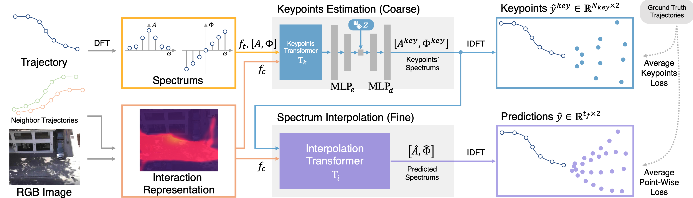

<!--
 * @Author: Conghao Wong
 * @Date: 2021-08-05 15:51:15
 * @LastEditors: Conghao Wong
 * @LastEditTime: 2022-06-23 15:19:52
 * @Description: file content
 * @Github: https://github.com/cocoon2wong
 * Copyright 2022 Conghao Wong, All Rights Reserved.
-->

# Codes for View Vertically: A Hierarchical Network for Trajectory Prediction via Fourier Spectrums



## Abstract

Understanding and forecasting future trajectories of agents are critical for behavior analysis, robot navigation, autonomous cars, and other related applications.
Previous methods mostly treat trajectory prediction as time sequences generation.
In this work, we try for the first time to focus on agents' trajectories in a vertical view, i.e., the spectral domain for the trajectory prediction.
Different frequency bands in the trajectory spectrum can reflect different preferences hierarchically.
The low-frequency and high-frequency portions represent the coarse motion trends and the fine motion variations, respectively.
Accordingly, we propose a hierarchical network named $V^2$-Net containing two sub-networks to model and predict agents' behaviors with trajectory spectrums hierarchically.
The coarse-level keypoints estimation sub-network infers trajectory keypoints on the trajectory spectrum to present agents' motion trends.
The fine-level spectrum interpolation sub-network reconstructs trajectories from the spectrum of keypoints considering the detailed motion variations.
Experimental results show that $V^2$-Net improves the state-of-the-art performance by 14.2\% on ETH-UCY benchmark and by 17.2\% on the Stanford Drone Dataset.

## Requirements

The packages and versions used in our experiments are included in the [requirements.txt](../../requirements.txt) file.
We recommend you install the above versions of the python packages in a virtual environment (like the `conda` environment), otherwise there *COULD* be other problems due to version conflicts.

Please run the following command to install the required packages:

```bash
pip install -r requirements.txt
```

## Training On Your Datasets

The `V^2-Net` contains two main sub-networks, the coarse-level keypoints estimation sub-network and the fine-level spectrum interpolation sub-network.
`V^2-Net` forecast agents' multiple stochastic trajectories end-to-end.
Considering that most of the loss function terms used to optimize the model work within one sub-network alone, we divide `V^2-Net` into `V^2-Net-a` and `V^2-Net-b`, and apply gradient descent separately for easier training.
You can train your own `V^2-Net` weights on your datasets by training each of these two sub-networks.
But don't worry, you can use it as a normal end-to-end model after training.

### Dataset

Before training `V^2-Net` on your own dataset, you can add your dataset information to the `datasets` directory.

- Dataset Splits File:

  It contains the dataset splits used for training and evaluation.
  For example, you can save the following python `dict` object as the `MyDataset.plist` (Maybe a python package like `biplist` is needed):

  ```python
  my_dataset = {
    'test': ['test_subset1'],
    'train': ['train_subset1', 'train_subset2', 'train_subset3'],
    'val': ['val_subset1', 'val_subset2'],
  }
  ```

- Sub-Dataset File:

  You should edit and put information about all sub-dataset, which you have written into the dataset splits file, into the `/datasets/subsets` directory.
  For example, you can save the following python `dict` object as the `test_subset1.plist`:

  ```python
  test_subset1 = {
    'dataset': 'test_subset1',    # name of that sub-dataset
    'dataset_dir': '....',        # root dir for your dataset csv file
    'order': [1, 0],              # x-y order in your csv file
    'paras': [1, 30],             # [your data fps, your video fps]
    'scale': 1,                   # scale when save visualization figs
    'video_path': '....',         # path for the corresponding video file 
  }
  ```

  Besides, all trajectories should be saved in the following `true_pos_.csv` format:

  - Size of the matrix is 4 x numTrajectoryPoints
  - The first row contains all the frame numbers
  - The second row contains all the pedestrian IDs
  - The third row contains all the y-coordinates
  - The fourth row contains all the x-coordinates

### `V^2-Net-a`

It is actually the coarse-level keypoints estimation sub-network.
To train the `V^2-Net-a`, you can pass the `--model va` argument to run the `main.py`.
You should also specify the indexes of the temporal keypoints in the predicted period.
For example, when you want to train a model that predicts future 12 frames of trajectories, and you would like to set $N_{key} = 3$ (which is the same as the basic settings in our paper), you can pass the `--key_points 3_7_11` argument when training.
Please note that indexes are start with `0`.
You can also try any other keypoints settings or combinations to train and obtain the `V^2-Net-a` that best fits your datasets.
Please refer to section `Args Used` to learn how other args work when training and evaluating.
Note that do not pass any value to `--load` when training, or it will start *evaluating* the loaded model.

For example, you can train the `V^2-Net-a` via the following minimum arguments:

```bash
cd REPO_ROOT_DIR
python main.py --model va --key_points 3_7_11 --test_set MyDataset
```

### `V^2-Net-b`

It is the fine-level spectrum interpolation sub-network.
You can pass the `--model vb` to run the training.
Please note that you should specify the number of temporal keypoints.
For example, you can pass the `--points 3` to train the corresponding sub-network that takes 3 temporal keypoints or their spectrums as the input.
Similar to the above `V^2-Net-a`, you can train the `V^2-Net-b` with the following minimum arguments:

```bash
python main.py --model vb --points 3 --test_set MyDataset
```

## Evaluation

You can use the following command to evaluate the `V^2-Net` performance end-to-end:

```bash
python main.py \
  --model V \
  --loada A_MODEL_PATH \
  --loadb B_MODEL_PATH
```

Where `A_MODEL_PATH` and `B_MODEL_PATH` are two sub-networks' weights.

## Pre-Trained Models

We have provided our pre-trained model weights to help you quickly evaluate the `V^2-Net` performance.
Click [here](drive.google.com) to download the zipped weights file.
Please unzip it to the project's root folder.
It contains model weights trained on `ETH-UCY` by the `leave-one-out` stragety, and on `SDD` via the dataset split method from SimAug.

```null
REPO_ROOT_DIR
  - pretrained_models
    - vertical
      - a_eth
      - a_hotel
      - a_sdd
      - a_univ
      - a_zara1
      - a_zara2
      - b_eth
      - b_hotel
      - b_sdd
      - b_univ
      - b_zara1
      - b_zara2
```

You can start the quick evaluation via the following commands:

```bash
for dataset in eth hotel univ zara1 zara2 sdd
  python main.py \
    --model vertical \
    --loada ./weights/vertical/a_${dataset} \
    --loadb ./weights/vertical/b_${dataset}
```

## Args Used

Please specific your customized args when training or testing your model through the following way:

```bash
python main.py --ARG_KEY1 ARG_VALUE2 --ARG_KEY2 ARG_VALUE2 --ARG_KEY3 ARG_VALUE3 ...
```

where `ARG_KEY` is the name of args, and `ARG_VALUE` is the corresponding value.
All args and their usages when training and testing are listed below. Args with `changable=True` means that their values can be changed after training.

<!-- DO NOT CHANGE THIS LINE -->
### Basic args

- `--K_train`, type=`int`, argtype=`'static'`.
  Number of multiple generations when training. This arg only works for `Generative Models`.
  The default value is `10`.
- `--K`, type=`int`, argtype=`'dynamic'`.
  Number of multiple generations when test. This arg only works for `Generative Models`.
  The default value is `20`.
- `--batch_size`, type=`int`, argtype=`'dynamic'`.
  Batch size when implementation.
  The default value is `5000`.
- `--draw_distribution`, type=`int`, argtype=`'dynamic'`.
  Conrtols if draw distributions of predictions instead of points.
  The default value is `0`.
- `--draw_results`, type=`int`, argtype=`'dynamic'`.
  Controls if draw visualized results on video frames. Make sure that you have put video files into `./videos` according to the specific name way.
  The default value is `0`.
- `--epochs`, type=`int`, argtype=`'static'`.
  Maximum training epochs.
  The default value is `500`.
- `--force_set`, type=`str`, argtype=`'dynamic'`.
  Force test dataset. Only works when evaluating when `test_mode` is `one`.
  The default value is `'null'`.
- `--gpu`, type=`str`, argtype=`'dynamic'`.
  Speed up training or test if you have at least one nvidia GPU. If you have no GPUs or want to run the code on your CPU, please set it to `-1`.
  The default value is `'0'`.
- `--load`, type=`str`, argtype=`'dynamic'`.
  Folder to load model. If set to `null`, it will start training new models according to other args.
  The default value is `'null'`.
- `--log_dir`, type=`str`, argtype=`'static'`.
  Folder to save training logs and models. If set to `null`, logs will save at `args.save_base_dir/current_model`.
  The default value is `dir_check(default_log_dir)`.
- `--lr`, type=`float`, argtype=`'static'`.
  Learning rate.
  The default value is `0.001`.
- `--model_name`, type=`str`, argtype=`'static'`.
  Customized model name.
  The default value is `'model'`.
- `--model`, type=`str`, argtype=`'static'`.
  Model type used to train or test.
  The default value is `'none'`.
- `--obs_frames`, type=`int`, argtype=`'static'`.
  Observation frames for prediction.
  The default value is `8`.
- `--pred_frames`, type=`int`, argtype=`'static'`.
  Prediction frames.
  The default value is `12`.
- `--restore`, type=`str`, argtype=`'dynamic'`.
  Path to restore the pre-trained weights before training. It will not restore any weights if `args.restore == 'null'`.
  The default value is `'null'`.
- `--save_base_dir`, type=`str`, argtype=`'static'`.
  Base folder to save all running logs.
  The default value is `'./logs'`.
- `--save_model`, type=`int`, argtype=`'static'`.
  Controls if save the final model at the end of training.
  The default value is `1`.
- `--start_test_percent`, type=`float`, argtype=`'static'`.
  Set when to start validation during training. Range of this arg is `0 <= x <= 1`. Validation will start at `epoch = args.epochs * args.start_test_percent`.
  The default value is `0.0`.
- `--step`, type=`int`, argtype=`'dynamic'`.
  Frame interval for sampling training data.
  The default value is `1`.
- `--test_mode`, type=`str`, argtype=`'dynamic'`.
  Test settings, canbe `'one'` or `'all'` or `'mix'`. When set it to `one`, it will test the model on the `args.force_set` only; When set it to `all`, it will test on each of the test dataset in `args.test_set`; When set it to `mix`, it will test on all test dataset in `args.test_set` together.
  The default value is `'mix'`.
- `--test_set`, type=`str`, argtype=`'static'`.
  Dataset used when training or evaluating.
  The default value is `'zara1'`.
- `--test_step`, type=`int`, argtype=`'static'`.
  Epoch interval to run validation during training. """ return self._get('test_step', 3, argtype='static') """ Trajectory Prediction Args 
  The default value is `3`.
- `--use_extra_maps`, type=`int`, argtype=`'dynamic'`.
  Controls if uses the calculated trajectory maps or the given trajectory maps. The model will load maps from `./dataset_npz/.../agent1_maps/trajMap.png` if set it to `0`, and load from `./dataset_npz/.../agent1_maps/trajMap_load.png` if set this argument to `1`.
  The default value is `0`.
- `--use_maps`, type=`int`, argtype=`'static'`.
  Controls if uses the context maps to model social and physical interactions in the model.
  The default value is `1`.

### Vertical args

- `--K_train`, type=`int`, argtype=`'static'`.
  Number of multiple generations when training.
  The default value is `1`.
- `--K`, type=`int`, argtype=`'dynamic'`.
  Number of multiple generations when evaluating. The number of trajectories predicted for one agent is calculated by `N = args.K * args.Kc`, where `Kc` is the number of style channels.
  The default value is `1`.
- `--Kc`, type=`int`, argtype=`'static'`.
  Number of hidden categories used in alpha model.
  The default value is `20`.
- `--depth`, type=`int`, argtype=`'static'`.
  Depth of the random noise vector (for random generation).
  The default value is `16`.
- `--feature_dim`, type=`int`, argtype=`'static'`.
  (It is unused in this model) 
  The default value is `-1`.
- `--key_points`, type=`str`, argtype=`'static'`.
  A list of key-time-steps to be predicted in the agent model. For example, `'0_6_11'`.
  The default value is `'0_6_11'`.
- `--points`, type=`int`, argtype=`'static'`.
  Controls number of points (representative time steps) input to the beta model. It only works when training the beta model only.
  The default value is `1`.
<!-- DO NOT CHANGE THIS LINE -->
